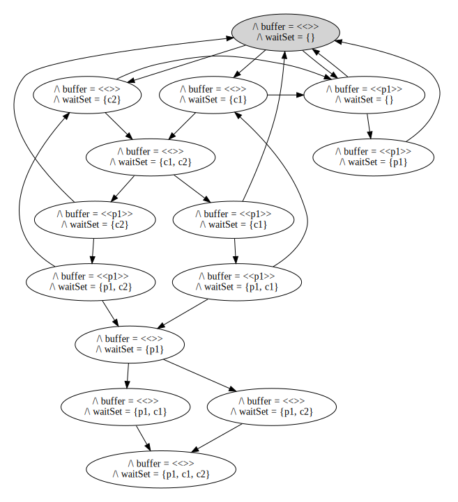
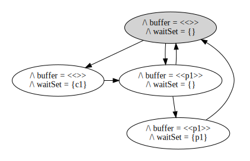

# BlockingQueue
Tutorial-style talk "Weeks of debugging can save you hours of TLA+".  The inspiration  for this tutorial and definitive background reading material (with spoilers) is ["An Example of Debugging Java with a Model Checker
"](http://www.cs.unh.edu/~charpov/programming-tlabuffer.html) by [Michel Charpentier](http://www.cs.unh.edu/~charpov/).  I believe it all goes back to [Challenge 14](http://wiki.c2.com/?ExtremeProgrammingChallengeFourteen) of the c2 wiki.

Each [git commit](https://github.com/lemmy/BlockingQueue/commits/tutorial) introduces a new TLA+ concept.  Go back to the very first commit to follow along!  Please note that the git history will be rewritten frequently.

[Click here for a zero-install environment to give the TLA+ specification language a try](https://gitpod.io/#https://github.com/lemmy/BlockingQueue).

This tutorial is work in progress. More chapters will be added in the future. In the meantime, feel free to open issues with questions, clarifications, and recommendations. You can also reach out to me on [twitter](https://twitter.com/lemmster).

--------------------------------------------------------------------------

### v04: Debug state graph for configuration p2c1b1.
    
In the previous step, we looked at the graphical representation of the state
graph.  With the help of TLCExt!PickSuccessor we build us a debugger
with which we study the state graph interactively.  We learn that with
configuration p2c1b1 there are two deadlock states:


The [CommunityModules](https://github.com/tlaplus/CommunityModules) release has to be added to TLC's command-line:

```
java -cp tla2tools.jar:CommunityModules.jar tlc2.TLC -deadlock BlockingQueue
```

Note that TLC's ```-continue``` flag would have also worked to find both
deadlock states.

### v03: State graph for configurations p1c2b1 and p2c1b1.
    
Slightly larger configuration with which we can visually spot the
deadlock: .

BlockingQueueDebug.tla/.cfg shows how to interactively explore a
state graph for configuration p2c1b1 with TLC in combination with
GraphViz (xdot):


```
java -jar tla2tools.jar -deadlock -dump dot,snapshot p2c1b1.dot BlockingQueueDebug
```

### v02: State graph for minimum configuration p1c1b1.
    
Initial TLA+ spec that models the existing (Java) code with all its
bugs and shortcomings.
    
The model uses the minimal parameters (1 producer, 1 consumer, and
a buffer of size one) possible.  When TLC generates the state graph with
```java -jar tla2tools.jar -deadlock -dump dot p1c1b1.dot BlockingQueue```,
we can visually verify that no deadlock is possible with this
configuration: .

### v01: Java and C implementations with configuration p4c3b3.
    
Legacy Java code with all its bugs and shortcomings.  At this point
in the tutorial, we only know that the code can exhibit a deadlock,
but we don't know why.
    
What we will do is play a game with the universe (non-determinism).
Launch the Java app with ```java -cp impl/src/ org.kuppe.App``` in
the background and follow along with the tutorial.  If the Java app
deadlocks before you finish the tutorial, the universe wins.

(For the c-affine among us, ```impl/producer_consumer.c``` is a C implementation of the blocking buffer sans most of the logging).

### v00: IDE setup, nothing to see here.
    
Add IDE setup for VSCode online and gitpod.io.
