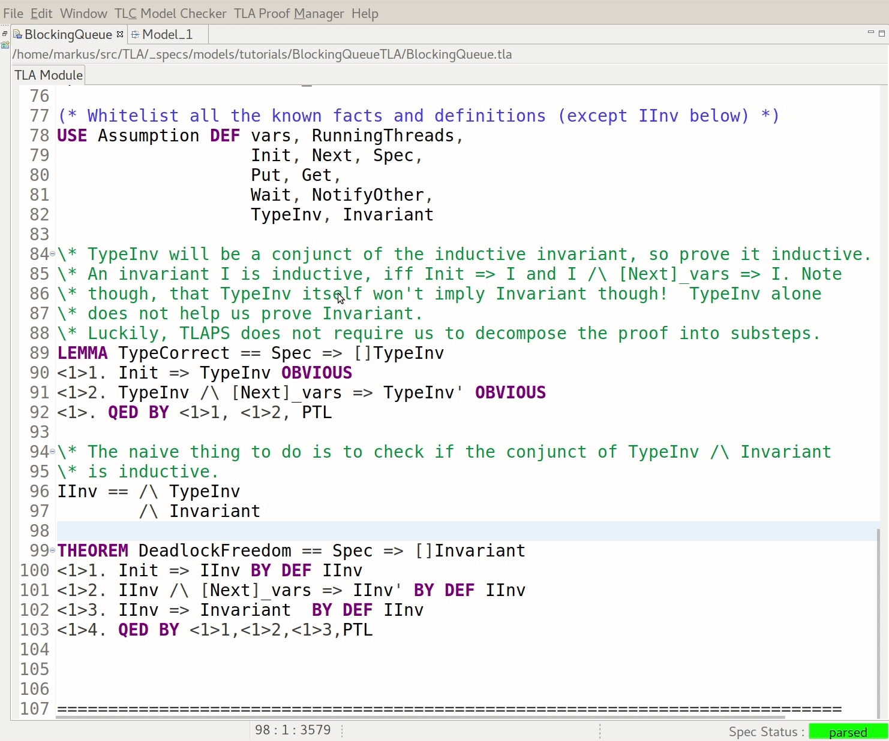
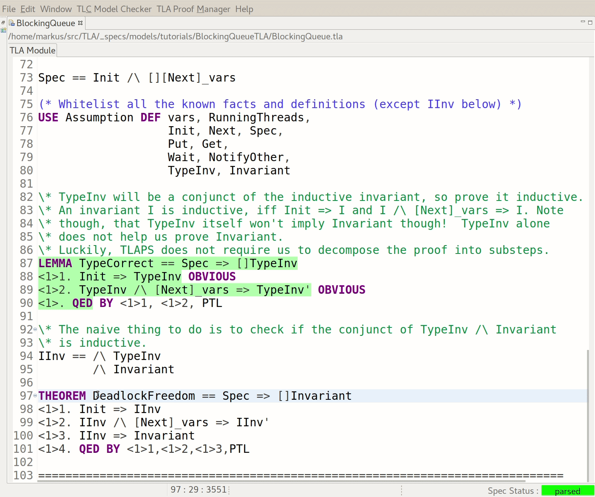
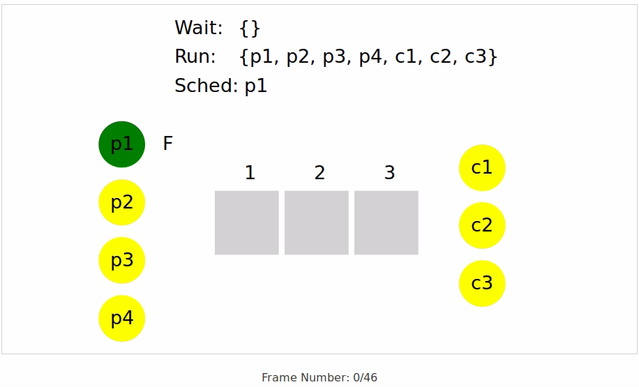
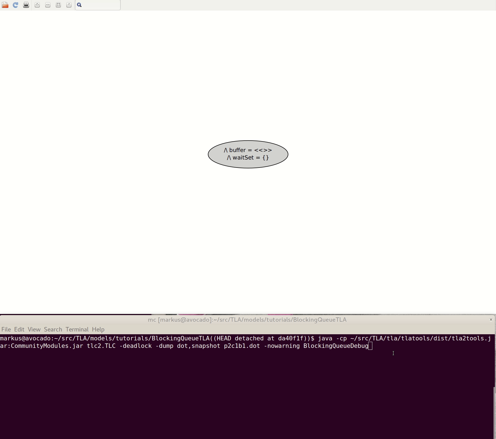

# BlockingQueue
Tutorial-style talk "Weeks of debugging can save you hours of TLA+".  The inspiration  for this tutorial and definitive background reading material (with spoilers) is ["An Example of Debugging Java with a Model Checker
"](http://www.cs.unh.edu/~charpov/programming-tlabuffer.html) by [Michel Charpentier](http://www.cs.unh.edu/~charpov/).  I believe it all goes back to [Challenge 14](http://wiki.c2.com/?ExtremeProgrammingChallengeFourteen) of the c2 wiki.

Each [git commit](https://github.com/lemmy/BlockingQueue/commits/tutorial) introduces a new TLA+ concept.  Go back to the very first commit to follow along!

[Click here for a zero-install environment to give the TLA+ specification language a try](https://gitpod.io/#https://github.com/lemmy/BlockingQueue).

--------------------------------------------------------------------------

### v16 (TLAPS): Validating an inductive invariant candidate.

Finding an inductive invariant is hard!  Fortunately, we can use TLC to - little by little - find and validate potential inductive invariants.  Some deeper thinking is at play too though:



Note that we rewrite the last conjunct of ```TypeInv``` to ```\in SUBSET```.  Check
the [discussion group](http://discuss.tlapl.us/msg00619.html) for the technical reason why.  We also re-define the Seq operator because its definition in the Sequences 
standard module is not enumerable.  We only re-define Seq in BlockingQueue.tla because the vscode extensions doesn't have a model editor yet.  Generally though, we would do this in the model to not taint the actual spec.

### v15 (TLAPS): Finding the inductive invariant.

The previous step was easy and straight forward!  Now comes the hard part: Finding
the inductive invariant that implies deadlock freedom.

Unfortunately, naive approach does not work: 

Invariant is not *inductive*, because ```Invariant /\ Next_vars => Invariant'``` does not
hold for e.g. the ```[buffer = <<>> /\ Wait(t)]_vars``` step (assum we are in the 
(unreachable) state with ```RunnintThreads = {t}```, the successor state will have
```RunningThreads' = {} /\ waitSet' = (Producers \cup Consumers)```.  A similar argument
applies to a ```[Len(buffer) = BufCapacity /\ Wait(t)]_vars``` step.

### v14 (TLAPS): Proof that TypeInv is inductive.

Recall that the deadlock originally only happened iff 
```2*BufCapacity < Cardinality(Producers \cup Consumers)```.  How do we know
that the solution with two mutexes hasn't a similar flaw, just for a different
inequation?  All the model-checking in the world won't gives us absolute
confidence, because the domains for Producers, Consumers, and BufCapacity are
infinite.  We have to prove that the solution with two mutexes is correct for all configurations no matter what values we chose for producer, consumer, or BufCapacity.

Here, we will use [TLAPS](https://tla.msr-inria.inria.fr/tlaps/content/Home.html) to take the first step towards an invariance proof of deadlock freedom by proving that ```TypeInv``` is inductive.  In the screencast below, TLAPS first checks the QED step,
then the 1<1> and 1<2> steps, and finally the top-level THEOREM.


Note that this step and the following ones require the TLA+ Toolbox and TLAPS! If
you don't have the Toolbox or TLAPS, you can skip this part (TLAPS.tla has been added to this repository to avoid parser errors).

--------------------------------------------------------------------------

### v13 (Bugfix): (Logically) two mutexes.

Remove notifyAll and instead introduce two mutexes (one for Producers
and one for Consumers).  A Consumer will notify the subset of
Producers waiting on the Producer mutex (vice versa for a Producer).
    
The spec does not have to introduce two mutexes.  Instead, we can
just pick the right thread type from the set of waiting threads.
    
This fix completely solves the bug, but are we fully satisfied yet?

### v12 (Bugfix): Always notify all waiting threads.

Always notify all waiting threads instead of a non-deterministically
selected one.  This fixes the deadlock bug but at a price: Load wil
spike when all (suspended) threads wake up at once.

### v11 (Bugfix): Non-deterministically notify waiting threads.

Non-deterministically notify waiting threads in an attempt to
fix the deadlock situation.  This attempt fails because we
might end up waking the wrong thread up over and over again.

### v10 (Animation): Add visualization of error-traces.
    
The trace with 2 procs, 1 cons, and a buffer of length 1 is
minimal (length 8).  The other trace shows how quickly the
issue becomes a) incomprehensible and b) the length of the
trace increases (46 states for 7 threads).  TLC takes 75 secs
on my machine to check this.




The animations are created in the Toolbox with:

1. Check model [BlockingQueue.cfg](BlockingQueue.cfg)
2. Set ```Animation``` as the trace expression in the Error-Trace console
3. Hit Explore and export/copy the resulting trace to clipboard
4. Paste into http://localhost:10996/files/animator.html

Without the Toolbox, something similar to this:

1. Check model [BlockingQueue.cfg](BlockingQueue.cfg) with ```java -jar tla2tools.jar -deadlock -generateSpecTE BlockingQueue``` ('-generateSpecTE' causes TLC to generate [SpecTE.tla](SpecTE.tla)/.cfg)
2. State trace expression ```Animation``` ([BlockingQueueAnim.tla](BlockingQueueAnim.tla))in SpecTE.tla
3. Download https://github.com/tlaplus/CommunityModules/releases/download/20200107.1/CommunityModules-202001070430.jar
4. Check SpecTE with ```java -jar tla2tools.jar:CommunityModules-202001070430.jar tlc2.TLC SpecTE```
5. Copy trace into http://localhost:10996/files/animator.html (minor format changes needed)

### v09 (Animation): Add prophecy variable to simplify animation.

The next-state relation has been restated to "predict"
the value of t (threads) in the successor state. We
will use the prophecy variable in the following
commit to come up with an animation.
    
This and the following commit can be skipped unless
you are interested in the more advanced concept of
prophecy (http://lamport.azurewebsites.net/pubs/auxiliary.pdf)
or animations (https://youtu.be/mLF220fPrP4).

### v08 (continue): Infer inequation under which the system is deadlock free.

Based on the scaffolding in the two previous steps, we run TLC with the [```-continue```](https://lamport.azurewebsites.net/tla/tlc-options.html?back-link=tools.html) option to not stop state space exploration after a violation of the invariant has been found.  In other words, we ask TLC to find all violations, not just one of the shortest ones (Breadth-First search guarantees that TLC finds the shortest counterexample first).

```bash
java -jar /opt/TLA+Toolbox/tla2tools.jar -deadlock -continue BlockingQueue | grep InvVio | sort | uniq
<<"InvVio", 1, 3>>
<<"InvVio", 1, 4>>
<<"InvVio", 1, 5>>
<<"InvVio", 1, 6>>
<<"InvVio", 1, 7>>
<<"InvVio", 1, 8>>
<<"InvVio", 2, 5>>
<<"InvVio", 2, 6>>
<<"InvVio", 2, 7>>
<<"InvVio", 2, 8>>
<<"InvVio", 3, 7>>
<<"InvVio", 3, 8>>
```

A little bit of bashery trims TLC's output so that we - with some squinting -  notice that ```BlockingQueue``` is deadlock free iff ```2*BufCapacity >= Cardinality(Producers \cup Consumers)```.

### v07 (continue): Declare Producers and Consumers to be symmetry sets.

The sets ```Producers``` and ```Consumers``` are symmetry sets for the ```BlockingQueue``` specification, meaning that permuting the elements in the sets does not change whether or not a behavior satisfies that behavior spec.  TLC can take advantage of this to reduce the number of (distinct) states it has to examine from 57254 to 1647!

Note that TLC does not check if a set you declare to be a symmetry set really is one.  If you declare a set to be a symmetry set and it isn't, then TLC can fail to find an error that it otherwise would find.  An expression is symmetric for a set ```S``` if and only if interchanging any two values of ```S``` does not change the value of the expression.  The expression ```{{v1, v2}, {v1, v3}, {v2, v3}}``` is symmetric for the set ```{v1, v2, v3}``` -- for example, interchanging ```v1``` and ```v3``` in this expression produces ```{{v3, v2}, {v3, v1}, {v2, v1}}```, which is equal to the original expression.  You should declare a set S of model values to be a symmetry set only if the specification and all properties you are checking are symmetric for S after the substitutions for constants and defined operators specified by the model are made.  For example, you should not declare ```{v1, v2, v3}``` to be a symmetry set if the model substitutes v1 for some constant.  The only TLA+ operator that can produce a non-symmetric expression when applied to a symmetric expression is CHOOSE.  For example, the expression

```tla
CHOOSE x \in {v1, v2, v3} : TRUE
```

is not symmetric for ```{v1, v2, v3}```. 

Symmetry sets should not be used when checking liveness properties.  Doing so can make TLC fail to find errors, or to report nonexistent errors.  The Toolbox adds a warning to the model when you try this.

(The description of this step originates from https://tla.msr-inria.inria.fr/tlatoolbox/doc/model/model-values.html)

### v06 (continue): Convert constants into variables.

In the section ["Limitations of Model-Checking"](http://www.cs.unh.edu/~charpov/programming-tlabuffer.html), Michel Charpentier points out that ```BlockingQueue``` is deadlock-free under some configurations, but that model checking is not helpful with finding the underlying mathematical function.  This observation is true in general because we cannot ask TLC to compute the set of all configurations for which ```BlockingQueue``` is deadlock-free, but at least we can ask it to find as many data points as possible. From those data points, we can try to infer/learn the function.

In this step, we rewrite ```BlockingQueue``` to check multiple configurations instead of a single one (p1c2b1) at once. Note that the rewrite increases the complete state space to 57254 distinct states, but TLC continues to find the behavior shown in the previous step. This is because TLC - by default - explores the state space with [breadth-first search](https://en.wikipedia.org/wiki/Breadth-first_search). This [search mode](https://tla.msr-inria.inria.fr/tlatoolbox/doc/model/tlc-options-page.html#checking) guarantees to always find the shortest counterexample (if TLC runs ```-workers N``` with N > 1, it only returns the shortest counterexample with high probability).

We hope to [better support checking different constant values](https://github.com/tlaplus/tlaplus/issues/272) in the future.

### v05: Add Invariant to detect deadlocks.

Add Invariant to detect deadlocks (and TypeInv). TLC now finds the deadlock
for configuration p1c2b1 (see below) as well as the one matching the Java
app p4c3b3.

```tla
Error: Invariant Invariant is violated.
Error: The behavior up to this point is:
State 1: <Initial predicate>
/\ buffer = <<>>
/\ waitSet = {}

State 2: <Next line 52, col 9 to line 55, col 45 of module BlockingQueue>
/\ buffer = <<>>
/\ waitSet = {c1}

State 3: <Next line 52, col 9 to line 55, col 45 of module BlockingQueue>
/\ buffer = <<>>
/\ waitSet = {c1, c2}

State 4: <Next line 52, col 9 to line 55, col 45 of module BlockingQueue>
/\ buffer = <<p1>>
/\ waitSet = {c2}

State 5: <Next line 52, col 9 to line 55, col 45 of module BlockingQueue>
/\ buffer = <<p1>>
/\ waitSet = {p1, c2}

State 6: <Next line 52, col 9 to line 55, col 45 of module BlockingQueue>
/\ buffer = <<>>
/\ waitSet = {p1}

State 7: <Next line 52, col 9 to line 55, col 45 of module BlockingQueue>
/\ buffer = <<>>
/\ waitSet = {p1, c1}

State 8: <Next line 52, col 9 to line 55, col 45 of module BlockingQueue>
/\ buffer = <<>>
/\ waitSet = {p1, c1, c2}
```

### v04: Debug state graph for configuration p2c1b1.
    
In the previous step, we looked at the graphical representation of the state
graph.  With the help of TLCExt!PickSuccessor we build us a debugger
with which we study the state graph interactively.  We learn that with
configuration p2c1b1 there are two deadlock states:


The [CommunityModules](https://github.com/tlaplus/CommunityModules) release has to be added to TLC's command-line:

```
java -cp tla2tools.jar:CommunityModules.jar tlc2.TLC -deadlock BlockingQueue
```

Note that TLC's ```-continue``` flag would have also worked to find both
deadlock states.

### v03: State graph for configurations p1c2b1 and p2c1b1.
    
Slightly larger configuration with which we can visually spot the
deadlock: .

BlockingQueueDebug.tla/.cfg shows how to interactively explore a
state graph for configuration p2c1b1 with TLC in combination with
GraphViz (xdot):



```
java -jar tla2tools.jar -deadlock -dump dot,snapshot p2c1b1.dot BlockingQueueDebug
```

### v02: State graph for minimum configuration p1c1b1.
    
Initial TLA+ spec that models the existing (Java) code with all its
bugs and shortcomings.
    
The model uses the minimal parameters (1 producer, 1 consumer, and
a buffer of size one) possible.  When TLC generates the state graph with
```java -jar tla2tools.jar -deadlock -dump dot p1c1b1.dot BlockingQueue```,
we can visually verify that no deadlock is possible with this
configuration: .

### v01: Java implementation with configuration p4c3b3.
    
Legacy Java code with all its bugs and shortcomings.  At this point
in the tutorial, we only know that the code can exhibit a deadlock,
but we don't know why.
    
What we will do is play a game with the universe (non-determinism).
Launch the Java app with ```java -cp impl/src/ org.kuppe.App``` in
the background and follow along with the tutorial.  If the Java app
deadlocks before you finish the tutorial, the universe wins.

### v00: IDE setup, nothing to see here.
    
Add IDE setup for VSCode online and gitpod.io.
